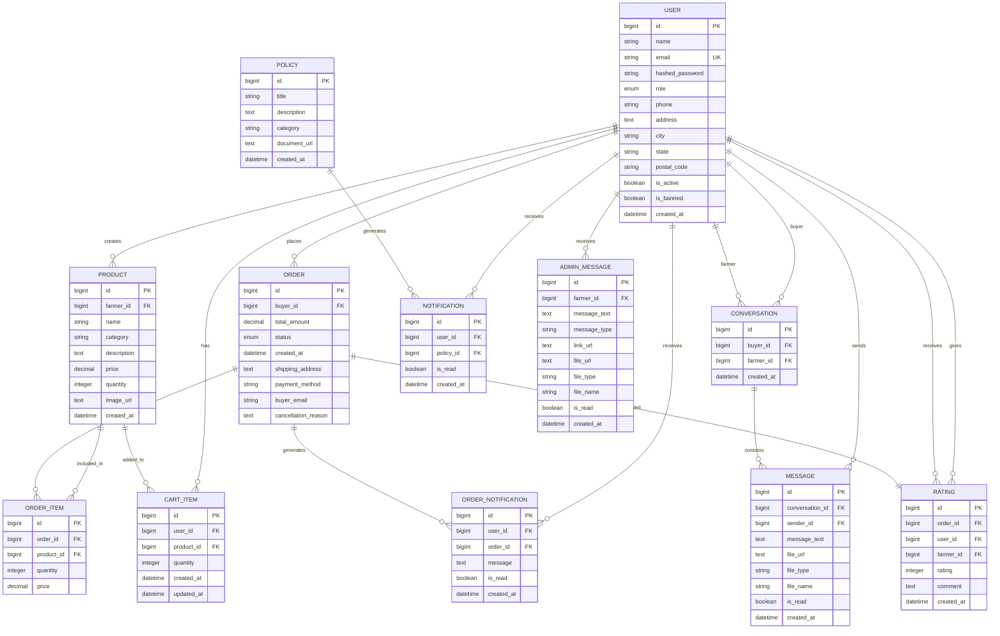
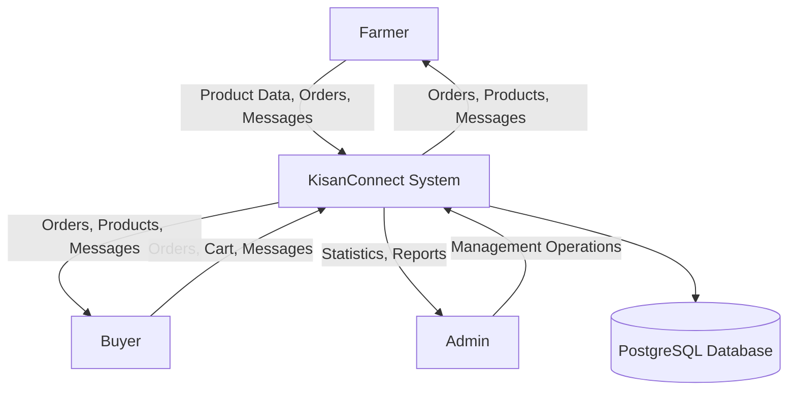
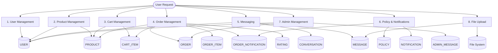
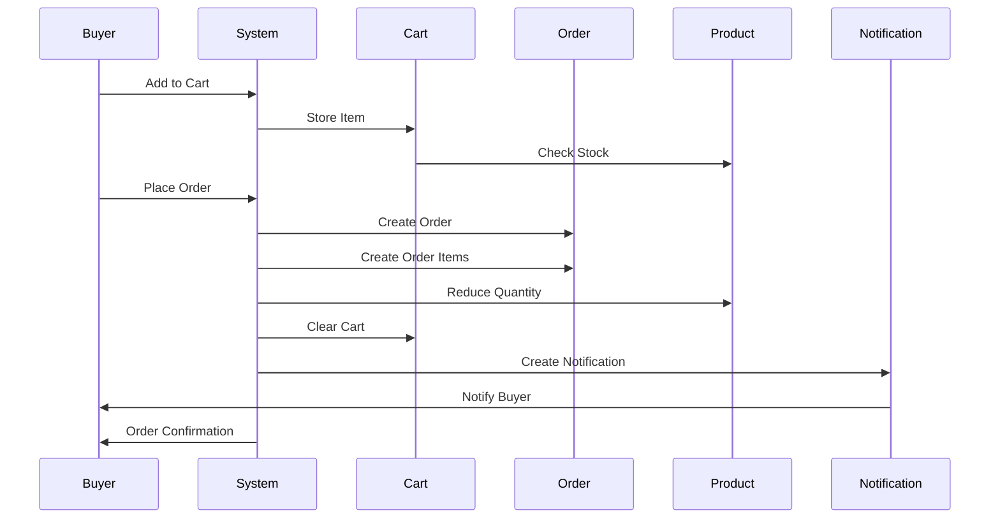
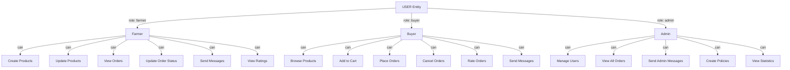
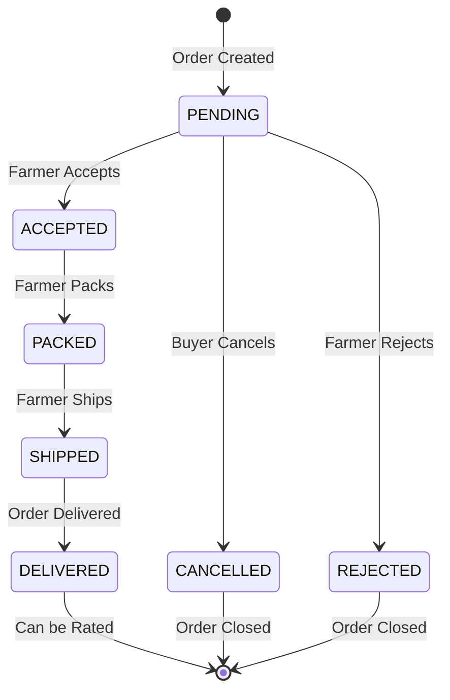
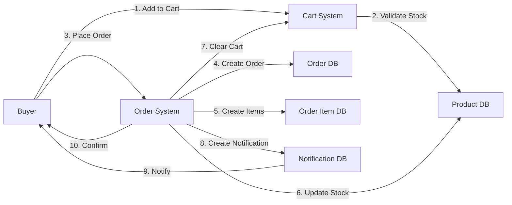
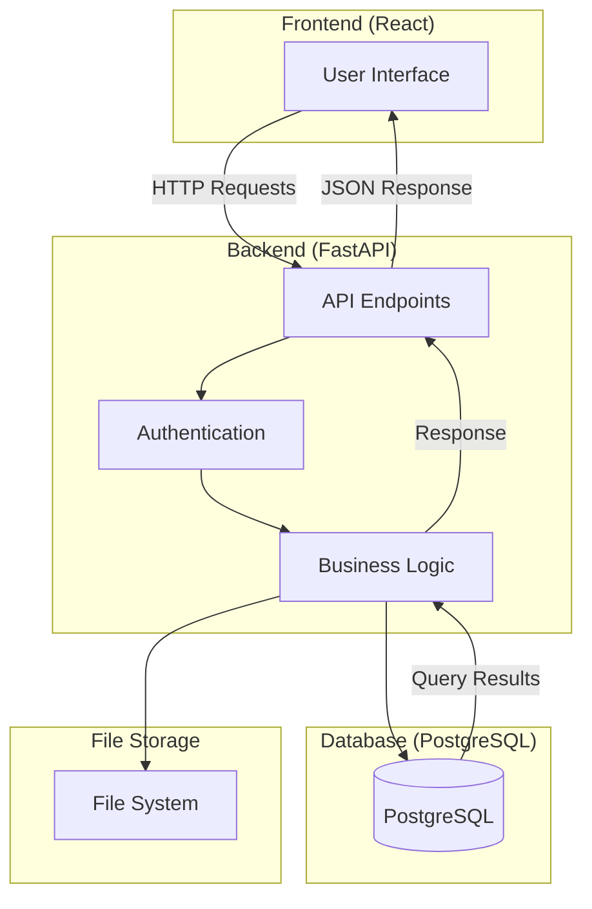

# Visual Diagrams - KisanConnect

## ER Diagram (Mermaid Syntax)

## DFD Level 0 - Context Diagram

## DFD Level 1 - Major Processes

## Order Processing Flow

## User Roles and Permissions

## Order Status Flow

## Data Flow - Order Creation

## System Architecture Overview

## Notes

- These diagrams use Mermaid syntax and can be rendered in:
  - GitHub/GitLab markdown
  - VS Code with Mermaid extension
  - Online tools like mermaid.live
  - Documentation sites like GitBook, Notion

- For professional diagrams, use the specifications in ER_DIAGRAM.md and DFD_DIAGRAM.md with tools like:
  - draw.io
  - Lucidchart
  - dbdiagram.io
